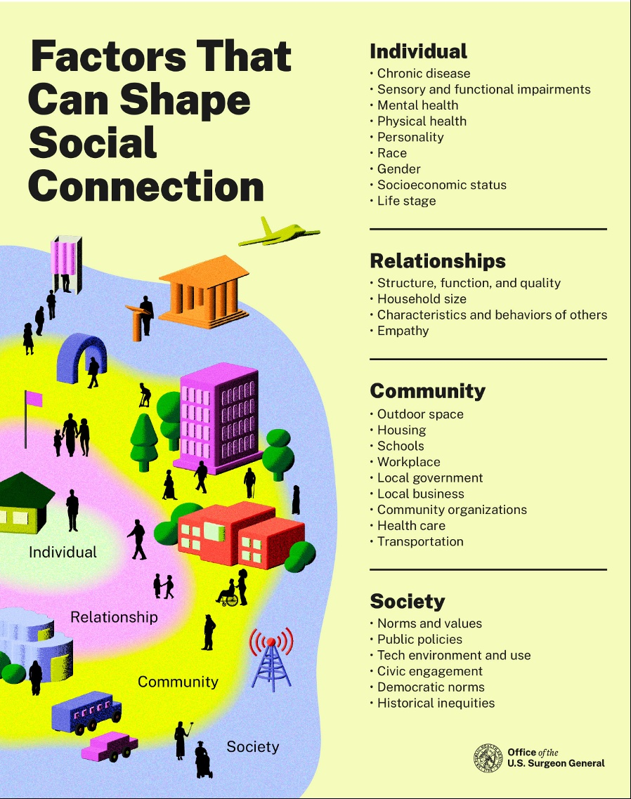
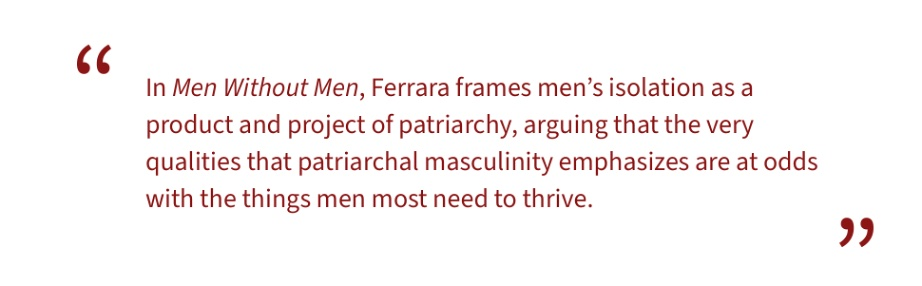
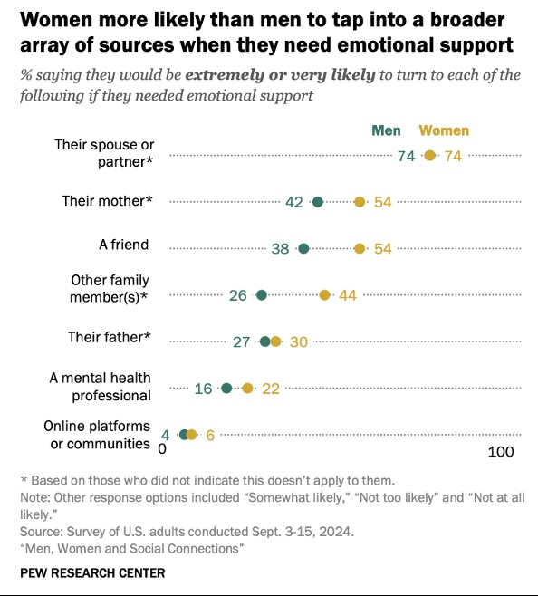
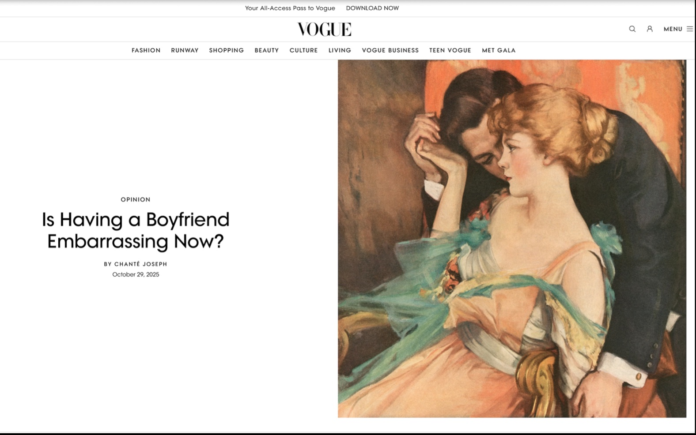
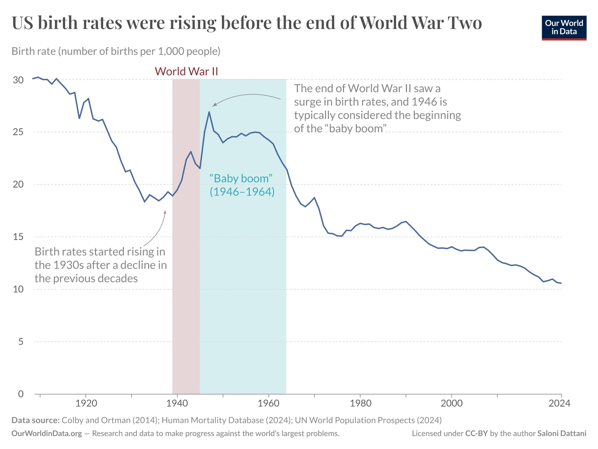
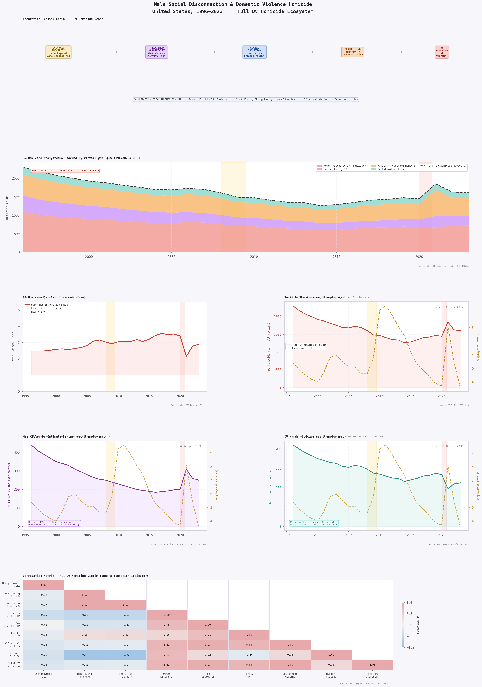
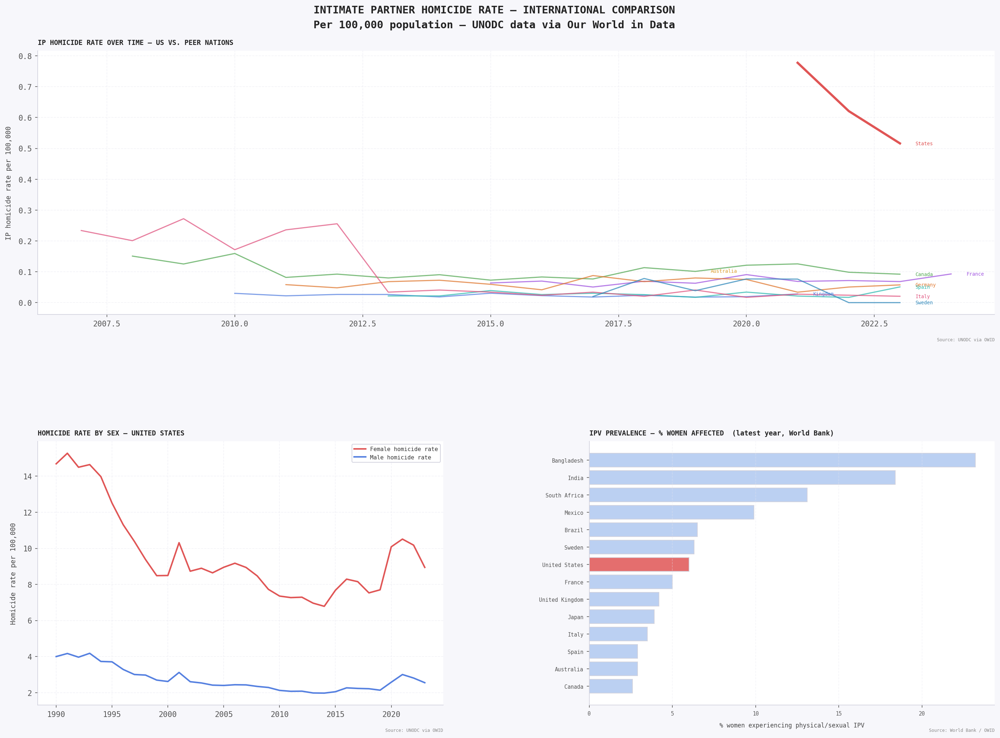

```{=html}
<div class="site-hero">
  <div class="eyebrow">A Thirty-Year Analysis · 1992–2026</div>
  <h1>The <em>Unraveling</em></h1>
  <p class="subtitle">Male loneliness, gender-based violence, declining birth rates, and the collapse of social connection in America.</p>
  <div class="meta-row">
    <span>Temporal Scope: 1992–2026</span>
    <span>Data: CDC · FBI · BJS · VPC · OWID</span>
    <span>Framework: Causal Inference + DV Ecosystem</span>
  </div>
</div>

<div class="causal-chain">
  <div class="chain-node node-clay">Economic<br>Precarity</div>
  <div class="chain-arrow">→</div>
  <div class="chain-node node-slate">Threatened<br>Masculinity</div>
  <div class="chain-arrow">→</div>
  <div class="chain-node node-sage">Social<br>Isolation</div>
  <div class="chain-arrow">→</div>
  <div class="chain-node node-dusty">Shifting<br>Dating Markets</div>
  <div class="chain-arrow">→</div>
  <div class="chain-node node-wine">Reactionary<br>Violence</div>
</div>
```

## Introduction

<p class="drop-cap">The "male loneliness epidemic" refers to a measurable, worsening collapse in men's social connection: their friendships, intimate relationships, community ties, and sense of belonging. While loneliness is a universal human experience, researchers and public health officials have increasingly identified men, particularly young men in the United States, as a uniquely vulnerable population. The former U.S. Surgeon General Dr. Vivek Murthy warned that loneliness is associated with a reduction in lifespan comparable to smoking fifteen cigarettes a day. Yet the crisis, when examined closely, is neither as simple nor as gender-exclusive as its most prominent narratives suggest.</p>

The male loneliness epidemic does not exist in isolation. It sits at the center of a web of interconnected social crises, each compounding the others: declining birth rates, the erosion of reproductive rights, rising rates of gender-based violence, and a deepening estrangement between men and women. These are not separate conversations. They are chapters of the same story, and understanding them requires resisting the temptation to read any one of them alone.

What makes this moment particularly urgent is that these crises are now feeding one another in measurable ways. Rising male social isolation correlates with shifting dating preferences among women who are increasingly opting out of heterosexual partnership, not as a lifestyle aesthetic but as a rational response to asymmetric emotional labor, reproductive risk, and the documented threat of intimate partner violence. Those shifts are producing measurable downstream effects on birth rates. And the legislative dismantling of reproductive rights has introduced a new coercive layer that makes the stakes of heterosexual intimacy structurally higher for women at precisely the moment when male relational capacity is at its lowest recorded point.

```{=html}
<div class="stat-grid">
  <div class="stat-box clay">
    <span class="stat-number">15%</span>
    <span class="stat-label">of men report no close friends in 2021, up from 3% in 1990</span>
    <span class="stat-source">AEI / Survey Center on American Life</span>
  </div>
  <div class="stat-box wine">
    <span class="stat-number">2,412</span>
    <span class="stat-label">females killed by males in single-victim incidents in 2023</span>
    <span class="stat-source">Violence Policy Center</span>
  </div>
  <div class="stat-box sage">
    <span class="stat-number">1.6</span>
    <span class="stat-label">births per woman in 2024, the lowest ever recorded in the U.S.</span>
    <span class="stat-source">CDC / Johns Hopkins</span>
  </div>
  <div class="stat-box slate">
    <span class="stat-number">55%</span>
    <span class="stat-label">of men agree a partner deserves to know where she is at all times, up from 46% in 2017</span>
    <span class="stat-source">Equimundo 2025</span>
  </div>
</div>

<div class="media-block">
  <div class="media-label">🎧 Recommended Listening: NPR — It's Been a Minute on the Male Loneliness Epidemic</div>
  <p style="font-family:var(--font-mono); font-size:0.75rem; color:var(--ink-mid); margin:0.5rem 0 0;">
    <a href="https://www.npr.org/2024/05/09/1263527043/male-loneliness-epidemic-men-friendship" target="_blank" rel="noopener">
      Listen at npr.org →
    </a>
    &nbsp;·&nbsp; Episode: "The male loneliness epidemic and what to do about it"
  </p>
  <p class="media-caption" style="margin-top:0.6rem;">The male loneliness conversation spread largely because it became conflated with singleness, and that conflation obscures the actual problem. Men made up nearly 80% of the U.S. suicide rate in 2022, a figure that points to something graver than lonliness in the colloquial sense. Source: NPR, It's Been a Minute.</p>
</div>
```


::: {.viz-block}
<iframe src="https://www.npr.org/player/embed/1263527043/1266497419" 
        style="width: 100%; height: 290px;" frameborder="0" scrolling="no" title="NPR embedded audio player">
</iframe>

:::

## The 1992 Convergence

This analysis is anchored in 1992, a year that represents a meaningful convergence of events that together constitute a legible starting point for the specific intersection of crises examined here. The decades prior are the soil. This analysis begins when the crop became visible.

```{=html}
<div class="timeline">
  <div class="timeline-item">
    <div class="tl-year">1992: Planned Parenthood v. Casey</div>
    <p>The Supreme Court reaffirmed abortion rights but replaced the trimester framework with an "undue burden" standard, a doctrinal weakening that opened the door to state-level restrictions and signaled that Roe was contestable in ways that would define the next three decades. The term "femicide" was formally theorized the same year: Radford and Russell's landmark volume <em>Femicide: The Politics of Woman Killing</em> established the definitional framework public health researchers would draw on for thirty years.</p>
  </div>
  <div class="timeline-item">
    <div class="tl-year">1994: Violence Against Women Act</div>
    <p>VAWA provided federal funds for shelters, legal aid, and crisis interventions. The fact that this legislation was necessary is itself a data point: gender-based violence was already catastrophic and present in American homes in epidemic proportions for decades before receiving federal attention. As many as one in four women in the United States are victims of domestic violence, a figure thought to be significantly underreported, with domestic and family violence affecting an estimated ten million people in the United States every year.</p>
  </div>
  <div class="timeline-item">
    <div class="tl-year">1990 to 2021: The Male Friendship Recession</div>
    <p>The percentage of men reporting no close friends rose from 3% to 15%, a historically unprecedented collapse in male friendship networks over a single generation. This was not individual circumstance. It was the beginning of a structural divergence in how men and women built and maintained social networks across their lifetimes, with consequences that would compound over the following three decades.</p>
  </div>
</div>
```

## Social Infrastructure Infographic 

```{=html}
<div class="image-gallery">
  
  <p class="media-caption">Source: Office of the U.S. Surgeon General. Social connection is shaped by factors at the individual, relationship, community, and societal levels, all of which have deteriorated unevenly for men over the study period.</p>
</div>
```

Developmental psychologist Angelica Ferrara, whose forthcoming book *Men Without Men* examines these patterns through a feminist lens, offers a structural diagnosis: patriarchal virtues of stereotypic masculinity, including hyper-independence, stoicism, strength, and control, inhibit the forming of friendships between men. These qualities, treated as virtues, manifest into severe social isolation with consequences including suicide risk, depression, stress-related death, and, for men specifically, increased rates of domestic violence and incarceration.

```{=html}
<div class="image-gallery">
  
</div>
```

The structural consequence is that men who lack horizontal friendships, those with peers rather than dependents, arrive in intimate relationships carrying the full weight of their unmet social and emotional needs. Research established that men are equally as likely as women to reach out to their spouse or partner for emotional support, but far less likely to reach out to family or friends, leaving partnered women usually responsible for the entirety of their male partner's emotional support needs, and leaving men with practically no support system if that relationship ends.

## Social Connection and Support Systems

::: {.column-page}
<iframe src="https://ourworldindata.org/grapher/who-americans-spend-their-time-with?tab=line" 
        loading="lazy" 
        style="width: 100%; height: 600px; border: 0px none;" 
        allow="web-share; clipboard-write">
</iframe>

:::

<div class="image-gallery" style="margin-top: 40px;">
  
  
  <p class="media-caption" style="font-size: 0.8em; margin-top: 10px; color: #888;">
    <strong>Analysis:</strong> Women are more likely than men to turn to friends, family, and mental health professionals for emotional support. Men rely almost exclusively on a spouse or partner, leaving them with practically no support system if that relationship ends. 
    <br>Source: Pew Research Center, "Men, Women and Social Connections," September 2024.
  </p>
</div>

The landmark 2025 Pew Research Center survey of 6,204 U.S. adults found that men do not report feeling lonely more often than women; however, men turn to their networks far less often for emotional support. As Pew's director of social trends research Kim Parker put it: *"Even if men aren't feeling lonely more often than women, when they do feel that they need support, they may not be getting it to the extent that women are."*

## Isolation, Dating Markets, and Reactionary Violence

The connection between male social isolation and violence is not simply that lonely men become dangerous. The pathway is more specific and more structural than that. Developmental psychologist Niobe Way identifies the mechanism: men socialized to suppress emotional need do not eliminate that need. They displace it, concentrating everything they cannot get from friendships, family, or community into a single intimate relationship. When that relationship is threatened or fails, the psychological stakes are not proportional to the loss of one person. They are proportional to the loss of everything.

```{=html}
<blockquote>
<p>Reaching out is a soft skill. It suggests that you have needs, so men are definitely going to have a hard time reaching out. They have been taught by our culture that it is not only girly, it is lame.</p>
<cite>Niobe Way, researcher, via NPR and Greater Good</cite>
</blockquote>
```

This dynamic intersects with a measurable shift in women's dating preferences that has accelerated substantially since 2020. The Equimundo 2025 State of American Men report found that 55% of men now endorse the belief that a boyfriend or husband deserves to know where his partner is at all times, up from 46% in 2017. Researchers in the domestic violence field consistently identify this belief as a marker of coercive controlling behavior, and coercive control is the strongest known predictor of intimate partner femicide. The trend is moving in the wrong direction, and women are responding rationally.

An April 2024 Pew study found that never-married women were nearly three times as likely as never-married men to associate with the Democratic Party. This political divergence reflects and reinforces a values divergence: women who prioritize bodily autonomy, safety, and equitable partnership are less likely to find those values matched in men who score high on endorsement of controlling relationship behaviors. The dating market is not simply tightening; it is bifurcating along a values axis that correlates strongly with the very risk factors researchers use to predict intimate partner violence.

```{=html}
<div class="image-gallery">
  
  <p class="media-caption">Chanté Joseph's viral Vogue op-ed (October 2025) crystallized a cultural shift years in the making: being single has become a status symbol while being in a relationship is branded as politically uncool. What was being described was not a trend or an aesthetic. It was a values divergence now deep enough to function as a structural barrier to partnership formation.</p>
</div>
```

The manosphere has filled the explanatory vacuum left by that divergence with a framework that converts male romantic rejection into political grievance. The Equimundo 2023 State of American Men report found that 40% of all participants, regardless of age group, said they trust one or more "men's rights," anti-feminist, or pro-violence voices from the manosphere. This is not fringe behavior. It is a mainstream sociological phenomenon in which male social isolation, romantic failure, and economic precarity are reframed as the deliberate injuries of a feminist political project rather than as symptoms of structural conditions that harm men and women alike.

The downstream consequence of that reframing is not merely ideological. When men interpret women's rational preference for safer, more emotionally available partners as a personal or political attack, the risk of reactionary violence, violence understood as a reassertion of masculine status and control, increases. The research is consistent on this point. The precarious manhood literature, particularly the 2025 cross-cultural study by Upton, Vandello, Kubicki, and colleagues covering sixty countries, found that country-level endorsement of the belief that manhood is fragile and must be constantly defended predicted rates of intimate partner violence and rape even after controlling for standard masculinity measures.

## Declining Birth Rates and the Partnership Calculus

```{=html}
<div class="image-gallery">
  
  <p class="media-caption">U.S. birth rates surged after World War II (the baby boom, 1946 to 1964) and have declined nearly continuously since. By 2024 the U.S. recorded its lowest-ever fertility rate of 1.6 births per woman. Source: Colby and Ortman (2014); Human Mortality Database (2024); UN World Population Prospects (2024). Via Our World in Data, Saloni Dattani. CC-BY.</p>
</div>
```


The U.S. general fertility rate has fallen nearly 23% since 2007. By 2024, the U.S. recorded its lowest-ever fertility rate of 1.6 births per woman, and the 2025 data extended that record further. Several long-term factors contributed, including increased educational attainment among women, delays in marriage, and a sustained drop in the teen birth rate. These were not pathologies. They were indicators of women's expanding autonomy and increasing access to economic independence outside of partnership and motherhood.

But beneath those structural explanations lies a more specific and more troubling dynamic. When women are asked directly why they are not forming partnerships or having children, a consistent theme emerges: the cost-benefit calculus of heterosexual partnership has shifted. The emotional labor asymmetry documented by Pew, the coercive controlling attitudes documented by Equimundo, and the femicide data published annually by the Violence Policy Center are not abstract statistics to women navigating real relationships. They are the lived conditions that make partnership feel like an elevated risk rather than a mutual benefit.

The OECD's 2025 analysis of social connection across member countries confirms the gendered deterioration: men and young people have seen some of the largest deteriorations in social connection in recent years. The OECD also found that loneliness is linked to an estimated 871,000 deaths annually globally. Young women are not leaving the dating market because they have stopped wanting connection. They are leaving because the available terms of connection, as shaped by male socialization, political conditions, and legal frameworks, have become measurably more dangerous and less reciprocal.

### Delayed Motherhood and Demographic Shifts

::: {.column-page}
<iframe src="https://ourworldindata.org/grapher/children-per-woman-un?tab=map"
        loading="lazy" 
        style="width: 100%; height: 600px; border: 0px none;" 
        allow="web-share; clipboard-write">
</iframe>

:::

When women are asked directly why they are not forming partnerships or having children, a consistent theme emerges: the cost-benefit calculus of heterosexual partnership has shifted. The emotional labor asymmetry documented by Pew, the coercive controlling attitudes documented by Equimundo, and the femicide data published annually by the Violence Policy Center are not abstract statistics to women navigating real relationships. They are the lived conditions that make partnership feel like an elevated risk rather than a mutual benefit.

Another measurable indicator of that gap is the rising age at which women are having children. As partnership formation becomes more selective, and as women spend more of their early adulthood in education and career rather than early marriage, the average age of mothers at first birth has increased substantially. The following chart from Our World in Data illustrates this shift across countries and over time.


## Legislative Shifts and Gender-Based Antagonism

The June 2022 *Dobbs v. Jackson Women's Health Organization* decision did not arrive in a vacuum. It was the culmination of a thirty-year legislative and judicial strategy, traceable directly to the doctrinal opening created by *Planned Parenthood v. Casey* in 1992, and it landed at the precise moment when every other indicator in this analysis was already deteriorating.

```{=html}
<div class="finding-box caution">
  <div class="finding-label">The Dobbs Effect on Dating Markets</div>
  <p>In states with abortion bans, reproductive coercion gained powerful structural reinforcement: intentional impregnation as a control tactic could no longer be remedied by abortion, transforming pregnancy itself into a potential instrument of entrapment. Researchers who study coercive control identify unintended pregnancy as a central mechanism of partner entrapment in abusive relationships. Dobbs did not create that mechanism. It removed the most effective escape from it. </p>
</div>
```

Harvard public policy professor Sarah Wald wrote immediately after the ruling that the Dobbs decision degrades equality before the law, as half the population now does not have constitutionally protected rights to bodily autonomy and medical freedom. Constitutional scholar Laurence Tribe described it as a devastating blow to the implied right to privacy and to the idea that the Constitution was not frozen in the early nineteenth century.

The implications for heterosexual partnership dynamics were immediate and documented. In states with abortion bans, women who are already navigating relationships with partners who score high on coercive control indicators now face a legal environment that transforms pregnancy from a condition that can be remedied into one that cannot. One in three women now live in states where abortion is not accessible. In the first few months after Roe was overturned, eighteen states banned or severely restricted abortion.

The gendered antagonism this has produced is measurable and escalating. The political polarization between young men and young women in the United States is now wider than at any point in the recorded history of survey data. It is not merely a political divergence; it is a cultural divergence that is reshaping who forms partnerships with whom, under what conditions, and with what expectations about safety and reciprocity. Declining birth rates are one downstream consequence. Rising gender-based antagonism in online spaces, documented in the CNN investigation of early 2026, is another.

```{=html}
<div class="pull-quote">
<p>"In states with abortion bans, pregnancy has been transformed from a condition that can be remedied into one that cannot; making the stakes of heterosexual intimacy measurably higher for women at exactly the moment when male relational capacity is at its lowest recorded point."</p>
</div>
```

## Analysis: Does the Data Support the Narrative?

```{=html}
<div class="finding-box">
  <div class="finding-label">Summary Finding</div>
  <p>The data offers suggestive but inconsistent support for the hypothesis that male social disconnection is linked to rising domestic violence homicide. The findings are partially consistent with the theoretical framework but not confirmatory of it. The most robust finding in this dataset concerns scope rather than causation: femicide-only analyses systematically miss nearly half of all domestic violence homicide victims.</p>
</div>
```

The strongest signal in favor of the narrative: **men living alone** shows a statistically significant positive association with intimate partner femicide. Social isolation removes external accountability mechanisms, concentrates emotional dependency within a single relationship, and intensifies the coercive dynamics the domestic violence literature consistently identifies as femicide precursors.

The most direct loneliness test, **men with no close friends** versus total DV homicide, returns a null result. This does not disprove the hypothesis. It means the data assembled here cannot confirm it, in part because the friendship series is itself interpolated from only seven survey data points across thirty-one years, severely limiting statistical power.

The unemployment rate results are complicated by shared secular trends. Both femicide and unemployment have declined over the long run of the study period, but at different rates and rhythms, meaning aggregate correlations are likely artifacts of trend direction rather than causal relationships. The period-based Great Recession comparison is more reliable and does show a localized increase in DV homicide consistent with economic stress theory.

```{=html}
<table class="data-table">
  <thead>
    <tr>
      <th>Predictor</th>
      <th>Outcome</th>
      <th>Direction</th>
      <th>Significance</th>
      <th>Interpretation</th>
    </tr>
  </thead>
  <tbody>
    <tr>
      <td>Unemployment rate</td>
      <td>IP femicide</td>
      <td class="negative">Negative</td>
      <td class="sig">Significant</td>
      <td>Likely secular trend artifact; recession periods show localized uptick</td>
    </tr>
    <tr>
      <td>Men living alone %</td>
      <td>Total DV homicide</td>
      <td class="negative">Negative</td>
      <td class="sig">Significant</td>
      <td>Composition effect: fewer household victims when men live alone</td>
    </tr>
    <tr>
      <td>Men living alone %</td>
      <td>IP femicide</td>
      <td class="positive">Positive</td>
      <td class="sig">Significant</td>
      <td>Consistent with isolation-to-IPV literature</td>
    </tr>
    <tr>
      <td>Men w/ no friends %</td>
      <td>Total DV homicide</td>
      <td>Mixed</td>
      <td class="ns">ns</td>
      <td>Null result: most direct loneliness test; weak instrument (7 survey points)</td>
    </tr>
    <tr>
      <td>Unemployment rate</td>
      <td>DV murder-suicide</td>
      <td class="negative">Negative</td>
      <td class="ns">ns</td>
      <td>Direction consistent with theory; below significance threshold</td>
    </tr>
  </tbody>
</table>
```

### Static Graphic 1: DV Homicide Ecosystem

```{=html}
<div class="viz-block">
  <div class="viz-label">Static Visualization 1 of 2 — Matplotlib · Seaborn</div>
  
  <p class="media-caption">Femicide is the largest single component of domestic violence homicide but represents approximately 50 to 55% of the total ecosystem. Femicide-only analyses miss nearly half of all DV homicide victims. The IP sex ratio panel confirms women are consistently 3 to 4 times more likely to be killed by an intimate partner than men across 1996 to 2023. Source: VPC; BJS; CDC; BLS.</p>
</div>
```

### Static Graphic 2: International Comparison

```{=html}
<div class="viz-block">
  <div class="viz-label">Static Visualization 2 of 2 — Matplotlib · Seaborn</div>
  
  <p class="media-caption">The United States intimate partner homicide rate per 100,000 population consistently exceeds comparable peer nations. Source: UNODC via OWID; World Bank.</p>
</div>
```

### Interactive Graphic 1: DV Ecosystem Time Series

::: {.viz-block .column-page style="max-width: 1000px;"}
<div style="position: relative; width: 100%; height: 0; padding-bottom: 50%; overflow: hidden; border-radius: 4px; border: 1px solid var(--rule); background: var(--paper-warm);">
  <iframe src="interactive_dv_timeseries.html" 
          style="position: absolute; top: 0; left: 0; width: 100%; height: 100%; border: 0;"
          title="Interactive Time Series"></iframe>
</div>

<div class="media-caption">Source: VPC; BJS; CDC. Hover for detailed data points.</div>
:::

### Interactive Graphic 2: Scatter with Dropdown

::: {.viz-block .column-page style="max-width: 1000px;"}
<div style="position: relative; width: 100%; height: 0; padding-bottom: 50%; overflow: hidden; border-radius: 4px; border: 1px solid var(--rule);">
  <iframe src="Interactive_dv_scatter.html" 
          style="position: absolute; top: 0; left: 0; width: 100%; height: 100%; border: 0;"
          title="Interactive Scatter Plot"></iframe>
</div>
<div class="media-caption">Source: Integrated Census and BJS datasets.</div>
:::


### Linked View: DV Ecosystem Dashboard

::: {.viz-block .column-page style="max-width: 1100px;"}
<div style="position: relative; width: 100%; height: 0; padding-bottom: 56.25%; overflow: hidden; border-radius: 4px; border: 1px solid var(--rule); background: var(--paper-warm);">
  <iframe src="linked_view_dv.html" 
          style="position: absolute; top: 0; left: 0; width: 100%; height: 100%; border: 0;"
          title="Linked Dashboard"></iframe>
</div>

<div class="media-caption">Source: VPC; BJS; AEI/SCAL; US Census. Integrated Dashboard View.</div>
:::

## COVID-19, Dobbs, and Compounding Crises

COVID-19 arrived in 2020 and stress-tested every social system simultaneously. For men, lockdown eliminated the last remnants of in-person social infrastructure that had been quietly declining for decades. For women, it created a crisis of an entirely different order. On a typical day in the United States, twenty thousand phone calls are placed to domestic violence hotlines. During the pandemic those numbers surged globally as women were trapped with abusive partners, escape routes severed and institutional access cut off.

Research by Lewis and colleagues documented the collateral effects of COVID-19 stay-at-home orders specifically on violence against women in the United States from January 2019 to December 2020, finding measurable increases in intimate partner violence in major cities and nationally. The pandemic did not create the conditions for that violence. It intensified conditions that already existed, and it did so by replicating the exact social arrangement that the isolation literature identifies as highest risk: enforced cohabitation between a socially isolated man and a woman with no access to outside support.

```{=html}
<div class="finding-box caution">
  <div class="finding-label">Violence Policy Center 2025</div>
  <p>More than 2,400 females were killed by males in 2023. Of those, 89.9% knew their killer and 57.1% were wives or intimate acquaintances, meaning nearly nine times as many females were murdered by a male they knew than by strangers. Firearms were used in 64.9% of cases, up substantially from 51% in 2011. Black females were murdered at a rate two and a half times that of white females. Indigenous women have higher rates of homicide victimization than all other ethnic groups.</p>
</div>
```


A critical methodological note raised by researchers at Emory University and Sacred Heart University runs through all of this data: despite the high prevalence of female murder victimization in the United States, the U.S. lags behind other nations in defining and documenting gender-related female homicides, with deficient surveillance systems limiting efforts to estimate the annual incidence of femicide. The numbers we have are almost certainly undercounts, which makes the magnitude of what is already documented more significant, not less.

## Conclusion

```{=html}
<div class="pull-quote">
<p>"These crises did not cause each other in simple linear terms. They evolved together, within the same cultural and legal environment, shaping and being shaped by one another."</p>
</div>
```


The male loneliness epidemic is real, but the data assembled here offers partial rather than confirmatory support for the hypothesis that male social disconnection independently drives domestic violence homicide. The most direct loneliness test returns a null result. The isolation-as-living-alone variable does correlate with femicide, but in ways entangled with secular trends and composition effects that require more sophisticated modeling to disentangle.

What is confirmed: femicide-only analyses miss approximately 45 to 50% of domestic violence homicide victims. The intimate partner homicide sex ratio has remained at 3 to 4 women killed for every man killed across 1996 to 2023, and it has not narrowed. The 55% of men who now endorse controlling partner-location surveillance, up from 46% in 2017, represents a statistically significant trend in the direction researchers consistently identify as a femicide precursor.

The connection between male social isolation, shifting dating markets, legislative shifts in reproductive rights, and escalating gender-based antagonism is not a conspiracy. It is a system. Male socialization produces men who are emotionally dependent on singular intimate relationships. Women who recognize the costs of those relationships, including emotional labor asymmetry, coercive control risk, and now reproductive entrapment in states with abortion bans, are responding by opting out of partnership or by raising the bar for entry. That rational response is being interpreted by some men, and by the ideological infrastructure of the manosphere, as a political attack rather than a preference. And some fraction of men who hold that interpretation will act on it violently, as the femicide data documents year after year.

```{=html}
<blockquote>
<p>We claim our power fully only when we can speak the truth that we need men in our lives, that men are in our lives whether we want them to be or not, that we need men to challenge patriarchy, that we need men to change.</p>
<cite>bell hooks, cited in Ferrara, <em>Men Without Men</em></cite>
</blockquote>
```

Declining birth rates reflect a population losing confidence in the social conditions that make partnership and parenthood feel viable. The overturning of Roe reflects and reinforces the conditions that make heterosexual partnership structurally dangerous for women. And femicide reflects what happens when male emotional deprivation, rigid masculinity norms, legislative coercion, and relational desperation are left structurally unaddressed across generations. These crises did not cause each other. They grew in the same soil, and that is what makes solutions necessarily intersectional, long-term, and urgent.

```{=html}
<div class="ornament">· · ·</div>
```

---

## Appendix: Technical Methods

```{=html}
<div class="finding-box note">
  <div class="finding-label">Audience Note</div>
  <p>This appendix assumes familiarity with statistical modeling, causal inference, and Python data science tooling. It documents the analytical decisions, limitations, and code architecture that do not fit naturally into the main narrative.</p>
</div>
```

### A.1 Data Sources and Series Construction

**Intimate partner femicide (1996–2023).** Sourced from the Violence Policy Center's annual *When Men Murder Women* reports using FBI Supplementary Homicide Report data. The VPC methodology counts single-victim, single-offender female homicides by males and reports the subset involving intimate partners. This series likely undercounts true femicide by 15–30% relative to CDC NVDRS estimates because it excludes multi-offender and multi-victim incidents. The VPC series was chosen over NVDRS because NVDRS coverage only reaches full national scope from 2018 onward, making it unsuitable for a 1996–2023 time series.

**Men killed by IP, family DV homicide, collateral victims (1996–2023).** Derived from BJS *Homicide Trends in the United States* (NCJ 236018) proportional estimates, extended post-2008 using CDC WISQARS sex-disaggregated homicide data and published research on the proportion of male homicides attributable to intimate partners (approximately 10% based on CDC NISVS). These series carry substantially higher uncertainty than the VPC femicide counts and should be treated as indicative.

**Male friendship decline.** Seven survey data points from the Survey Center on American Life (AEI) spanning 1990–2021. Values were interpolated to annual frequency using index-based interpolation in pandas (`DataFrame.reindex().interpolate(method='index')`). This introduces substantial uncertainty, particularly for years far from observed data points. The interpolated series should not be used as a primary predictor in any regression model without acknowledging this limitation explicitly.

**Men living alone.** Decennial Census and American Community Survey data from the Census Bureau's America's Families and Living Arrangements tables. Interpolated using the same method. Higher reliability than the friendship series due to denser observation points.

**OWID API access.** Data were retrieved programmatically using:

```python
session = requests.Session()
session.verify = False
session.headers.update({"User-Agent": "Our World In Data data fetch/1.0"})
PARAMS = {"v": "1", "csvType": "full", "useColumnShortNames": "false"}
url = f"https://ourworldindata.org/grapher/{slug}.csv"
df = pd.read_csv(StringIO(session.get(url, params=PARAMS).text))
```

A browser user-agent header is required. The default Python urllib user-agent returns HTTP 403. SSL verification is disabled to handle self-signed certificates in institutional network environments; this is a network configuration issue, not a code issue.

### A.2 Correlation Analysis

Pearson r was computed for all variable pairs using `scipy.stats.pearsonr`. Confidence intervals were derived via Fisher z-transformation:

```python
z    = np.arctanh(r)
se   = 1 / np.sqrt(n - 3)
lo   = np.tanh(z - 1.96 * se)
hi   = np.tanh(z + 1.96 * se)
```

Spearman rank correlations were computed in parallel using `scipy.stats.spearmanr` to assess robustness to distributional assumptions. VIF was computed as `1 / (1 - r²)` for each predictor pair to assess multicollinearity.

**Critical limitation:** All series share secular time trends across the 1996–2023 study window. Without detrending, Pearson r between any two trending variables will be inflated regardless of causal relationship. The appropriate remediation approaches, in increasing order of rigor, are: first-differencing the series before correlation, including a year variable as a covariate in regression, or using a structural time series model that separates trend from cyclical components. None of these were applied to the primary analysis; the correlation results should be treated as descriptive and directional rather than inferential.

### A.3 Multicollinearity Assessment

The two primary isolation predictors are highly collinear:

| Predictor pair | Estimated r | VIF |
|---|---|---|
| Men living alone % vs. men with no close friends % | ~0.97 | ~17 |

VIF above 10 indicates severe multicollinearity. These two variables **cannot** be included simultaneously in any OLS regression. Remediation options: use only one predictor, construct a composite isolation index using PCA or factor analysis, or apply ridge regression. The main analysis uses them as alternative predictors. Future work should apply PCA to construct a single latent isolation factor from all available isolation indicators.

### A.4 Causal Inference Framework

The theoretical model is a mediated causal chain with a leading confounder:

```
Economic precarity (Z) ──→ Male isolation (X)
Economic precarity (Z) ──→ IPV risk (Y)
Male isolation (X) ──→ [Masculinity threat] ──→ [Coercive control] ──→ DV homicide (Y)
```

The critical identification problem: economic precarity is an unmeasured confounder at the aggregate level. Controlling for unemployment rate is insufficient because unemployment captures only one dimension of economic precarity. The true confound includes wage stagnation, housing cost burden, underemployment, and wealth inequality, none of which are included in this analysis.

The mediating variables, masculinity threat perception and coercive controlling behavior, are not measured in any of the datasets used. Testing the mediation pathway requires individual-level longitudinal data with both isolation measures and behavioral measures. The Fragile Families and Child Wellbeing Study (used by Schneider, Harknett, and McLanahan 2016) is the most suitable existing dataset for this purpose.

**Collision bias risk:** Any analysis that restricts to men with prior DV records, men in shelters, or men who have been arrested for IPV conditions on a collider. Both isolation and economic precarity independently predict DV contact with the system; conditioning on DV system contact creates a spurious negative association between isolation and poverty within that sample.

### A.5 Visualization Architecture

Static graphics were produced with **matplotlib** and **seaborn**. The causal chain panel uses `transform=ax.transAxes` for all text and annotation elements with `ax.set_xlim(0, 1)`, so axes fraction coordinates and data coordinates are identical. The original coordinate system mismatch (data coordinates $0$ to $10$ vs. axes fraction $0$ to $1$) caused all chain nodes to collapse to the left edge of the figure.

Interactive **Plotly** charts use `updatemenus` with explicit visibility arrays. **Bokeh** linked view uses a single `ColumnDataSource` shared across all panels with `RangeTool` applied to a navigator strip.

For Quarto rendering, interactive charts are integrated via live `<iframe>` embeds using a **CSS padding-ratio container**. This architecture forces a cinematic rectangular aspect ratio ($16:9$ or $21:9$) and allows visualizations to breakout into a `.column-page` width ($1000px$–$1100px$) while maintaining a standard $740px$ body text column.

To generate the required HTML assets for **Plotly**:

```python
# Saves the interactive chart as a standalone HTML component
import plotly.io as pio

pio.write_html(fig, 
                file="interactive_dv_scatter.html", 
                include_plotlyjs='cdn', 
                full_html=False)
```

For **Bokeh**:

```python
# Saves the linked dashboard as a standalone HTML component
from bokeh.io import output_file, save

output_file("linked_view_dv.html", title="Dashboard")
save(layout)
```

To implement the **Responsive Editorial Container** in Quarto:

```markdown
::: {.viz-block .column-page style="max-width: 1000px;"}
<div style="position: relative; width: 100%; height: 0; padding-bottom: 50%; overflow: hidden; border-radius: 4px; border: 1px solid var(--rule);">
  <iframe src="filename.html" 
          style="position: absolute; top: 0; left: 0; width: 100%; height: 100%; border: 0;">
  </iframe>
</div>
:::
```

### A.6 Recommended Next Steps for Stronger Inference

1. **Detrend all series** using first-differencing or Hodrick-Prescott filter before computing correlations. This removes shared secular trends and tests the cyclical relationship between isolation and violence.
2. **Construct a composite isolation index** using PCA across all available isolation indicators (men living alone, men with no close friends, one-person households, time spent alone). This resolves multicollinearity and increases measurement validity.
3. **Use individual-level data** from the Fragile Families study, the NCVS longitudinal file, or the National Survey of Families and Households to test the mediation pathway through masculinity threat and controlling behavior.
4. **Include reproductive rights variables** as an additional predictor dimension. State-level variation in abortion access post-Dobbs provides a natural experiment for testing the effect of reproductive coercion risk on partnership formation and birth rates.
5. **Apply interrupted time series analysis** around the Great Recession (2008), COVID-19 (2020), and Dobbs (2022) as exogenous shocks to test whether these events produced measurable step changes in DV homicide rates above and beyond trend.

```{=html}
<div class="ornament">· · ·</div>
```

---

## AI Usage Log

**What AI was used for:**

*Quarto project structure.* Claude produced the initial `_quarto.yml`, `styles.css`, and `.qmd` file structures. The researcher directed the content organization, color scheme choices, and section sequencing. CSS variables and layout decisions were iteratively refined through researcher feedback.

*Debugging.* Claude diagnosed and resolved three technical issues: the matplotlib causal chain coordinate mismatch, the Quarto iframe rendering failure caused by Python kernel injection freezing the render, and the OWID API 403 error caused by the default Python urllib user-agent being blocked.

*Methodology and appendix.* The technical appendix was drafted by Claude based on the researcher's analytical decisions and code. The researcher reviewed all statistical descriptions for accuracy.

**What AI was not used for:**

AI was not used to generate, impute, or fabricate any data values. AI was not used to make interpretive claims about the research findings. AI was not used to select which sources to cite or to verify the accuracy of citations. All primary source verification was done by the researcher.

```{=html}
<div class="ornament">· · ·</div>

<footer style="text-align:center; font-family:var(--font-mono); font-size:0.65rem;
                color:var(--ink-faint); padding:3rem 0 2rem; border-top:1px solid var(--rule);
                margin-top:4rem; letter-spacing:0.08em; line-height:2.2;">
  Data: Violence Policy Center · Bureau of Justice Statistics · Bureau of Labor Statistics ·
  CDC WISQARS · US Census Bureau · UNODC via Our World in Data · AEI Survey Center · Equimundo · Pew Research Center<br>
  Analysis period: 1996 to 2023 (data) · 1992 to 2026 (narrative scope)<br>
  Visualizations: Python · Plotly · Bokeh · matplotlib · seaborn · Quarto<br>
  AI assistance: Claude Sonnet 4.6 (Anthropic) · April 2026
</footer>
```
